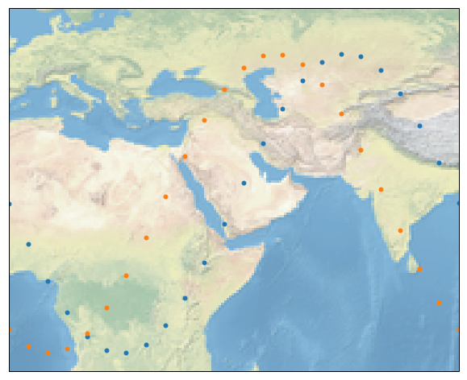
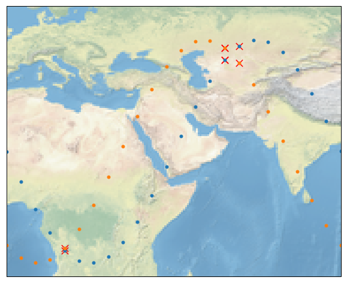
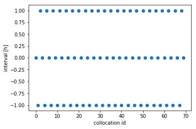

Find collocations with typhon
=============================

.. Warning::
   This tutorial is still under development and contains invalid code. It needs
   to get updated to work under the new typhon versions.

.. Hint::
   NOTE: The code in the jupyter notebooks is old and needs to be updated!
   If you want to run the code from this tutorial on your machine as well,
   download
   :download:`spareice_tutorials.zip<_downloads/spareice_tutorials.zip>` and
   unzip it. You can find the code examples for this tutorial in the jupyter
   notebook file *collocations.ipynb*. You will need the jupyter_ engine for
   this.

.. _jupyter: http://jupyter.org/install.html

Collocations between two data arrays
------------------------------------

Let's try out the simplest case: You have two data arrays with
temporal-spatial data and you want to find collocations between them.

At first, we create two example data arrays with faked measurements. Let's
assume, these data arrays represent measurements from two different instruments
(e.g. on satellites). Each measurement has a time attribute indicating when
it was taken and a geo-location (latitude and longitude) indicating where
this happened.

.. code-block:: python

    import cartopy.crs as projections
    from typhon.plots import worldmap
    
    # Create the data
    primary = {
        "time": np.arange("2018-01-01", "2018-01-02", dtype="datetime64[h]"),
        "lat": 30.*np.sin(np.linspace(-3.14, 3.14, 24))+20,
        "lon": np.linspace(0, 90, 24),
    }
    secondary = {
        "time": np.arange("2018-01-01", "2018-01-02", dtype="datetime64[h]"),
        "lat": 30.*np.sin(np.linspace(-3.14, 3.14, 24)+1.)+20,
        "lon": np.linspace(0, 90, 24),
    }
    
    # Plot the data
    fig = plt.figure(figsize=(10, 10))
    wmap,_ = worldmap(primary["lat"], primary["lon"], s=24, background=True)
    worldmap(secondary["lat"], secondary["lon"], s=24, ax=wmap,)
    wmap.set_extent([0, 90, -10, 50])

Now, let's find all measurements of *primary* that have a maximmum
distance of *300 kilometers* to the measurements of *secondary*:

.. code-block:: python

    from typhon.collocations import collocate
    
    indices = collocate([primary, secondary], max_distance=500,)
    print(indices)

.. parsed-literal::

    [[ 4 15 15 16]
     [ 4 15 16 15]]

This means, that the 4th point of *primary* collocates with the 4th
point of *secondary* and the 15th point of *primary* collocates with the
15th point of *secondary*, etc.

Let's mark the collocations with red crosses on the map:

.. code-block:: python

    fig = plt.figure(figsize=(10, 10))
    
    # Plot the collocations
    wmap,_ = worldmap(
        primary["lat"][indices[0]], primary["lon"][indices[0]], 
        c="r", s=128, marker='x', background=True
    )
    worldmap(
        secondary["lat"][indices[1]], secondary["lon"][indices[1]], 
        c="r", s=128, marker='x', ax=wmap,)
    
    # Plot all points:
    worldmap(primary["lat"], primary["lon"], s=24, ax=wmap,)
    worldmap(secondary["lat"], secondary["lon"], s=24, ax=wmap,)
    wmap.set_extent([0, 90, -10, 50])

We can also add a temporal filter that filters out all points which
difference in time is bigger than a time interval. We are doing this by
using *max\_interval*:

.. code-block:: python

    indices = collocate([primary, secondary], max_distance=300, max_interval="1 hour")
    print(indices)

.. parsed-literal::

    [[4]
     [4]]

If we are not interested in spatial collocations but only in temporal ones, we
can leave *max_distance* out:

.. code-block:: python

    # Find temporal collocations (without regarding the location)
    indices = collocate([primary, secondary], max_interval="1 hour")
    
    # Plot intervals
    interval = (primary["time"][indices[0]] - secondary["time"][indices[1]]).astype("int")
    plt.scatter(range(indices.shape[1]), interval)
    plt.xlabel("collocation id")
    plt.ylabel("interval [h]")

Find collocations between two filesets
--------------------------------------

.. Warning::
   This section is not up-to-date and will not work with the newest version of
   typhon. Please wait for an update.

Normally, one has the data stored in a set of many files. typhon
provides an object to handle those *filesets* (see the `typhon
doc <http://radiativetransfer.org/misc/typhon/doc-trunk/generated/typhon.files.filesets.FileSet.html>`__).
It is very simple to find collocations between them.

Firstly, we need to create FileSet objects and let them know where to find
their files:

.. code-block:: python
    
    from typhon.files import FileSet
    
    # Create the filesets objects and point them to the input files
    a_fileset = FileSet(
        name="SatelliteA",
        path="data/SatelliteA/{year}/{month}/{day}/"
             "{hour}{minute}{second}-{end_hour}{end_minute}{end_second}.nc"
    )
    b_fileset = FileSet(
        name="SatelliteB",
        path="data/SatelliteB/{year}/{month}/{day}/"
             "{hour}{minute}{second}-{end_hour}{end_minute}{end_second}.nc"
    )

If you do not know how to deal with those FileSet objects, try this
`tutorial <http://radiativetransfer.org/misc/typhon/doc-trunk/tutorials/fileset.html>`__.

Now, we can search for collocations between *a\_dataset* and
*b\_dataset* and store them to *ab\_collocations*.

.. code-block:: python

   from typhon.collocations import Collocations

   # Create the output dataset:
   ab_collocations = Collocations(
     name="ab_collocations",
     path="data/ab_collocations/{year}/{month}/{day}/"
          "{hour}{minute}{second}-{end_hour}{end_minute}{end_second}.nc.gz"
   )

   ab_collocations.search(
     [a_fileset, b_fileset], start="2018", end="2018-01-02",
     max_interval="1h", max_distance=300
   )

.. parsed-literal::

    Find collocations between SatelliteA and SatelliteB from 2018-01-01 00:00:00 to 2018-01-02 00:00:00
    Retrieve time coverages from files...

    ---------------------------------------------------------------------------

    TypeError                                 Traceback (most recent call last)

    <ipython-input-13-e1ef9a1d68df> in <module>()
          1 collocate_datasets(
          2     [a_dataset, b_dataset], start="2018", end="2018-01-02",
    ----> 3     output=ab_collocations, max_interval="1h", max_distance=300
          4 )

    ~/Projects/typhon/typhon/spareice/collocations/common.py in collocate_datasets(datasets, start, end, output, verbose, **collocate_args)
        701         print("Retrieve time coverages from files...")
        702 
    --> 703     for data, files in DataSlider(start, end, *datasets):
        704 
        705         primary_start, primary_end = data[primary.name].get_range("time")

    ~/Projects/typhon/typhon/spareice/datasets.py in move(self)
       2674 
       2675             data = self._align_to_primary(data, primary_data)
    -> 2676             data[self.datasets[0].name] = primary_data
       2677 
       2678             yield data, files

    TypeError: 'NoneType' object does not support item assignment

.. code-block:: python

    from typhon.spareice import collocate
    
    a_data = a_dataset.collect("2018", "2018-01-02")
    b_data = b_dataset.collect("2018", "2018-01-02")
    collocate(a_data, b_data, max_interval="1hour", max_distance=300)

.. parsed-literal::

    array([[ 69,  69,  79,  79,  79,  80,  80,  80,  89,  89,  89,  90,  90,
             90],
           [110, 109, 129, 130, 131, 129, 130, 131, 150, 149, 148, 150, 149,
            148]])

Find collocations between more than two datasets
------------------------------------------------

How about finding collocations between more than two datasets? Let's
assume we have an additional dataset from *Satellite C*:

.. code-block:: python

    from typhon.spareice.handlers import CSV
    
    c_dataset = Dataset(
        name="SatelliteC",
        path="data/SatelliteC/{year}/{doy}/{hour}{minute}{second}.dat.gz",
        # If you do not know, why we have to add these lines, try the tutorial link from above.
        handler=CSV(read_csv={"parse_dates":["time", ]}),
        time_coverage="05:59:59 hours",
    )

Collocating multiple datasets could mean two things: 1. Only find the
subset of collocations that have all collocated datasets in common.
**This is not yet implemented** 2. Find collocations of one dataset that
has been already collocated with a third dataset. This means for our
example, we would use the *a\_dataset* data points from
*ab\_collocations* and collocate them with the *c\_dataset*.

1. Find the subset of all collocations
~~~~~~~~~~~~~~~~~~~~~~~~~~~~~~~~~~~~~~

Point 1 is still not implemented. However, it is planned to do it like
this: Simply pass more datasets objects to the *Collocator.read()*
method.

.. code-block:: python

    # Create the output dataset:
    abc_collocations = CollocatedDataset(
        path="data/abc_collocations/{year}/{month}/{day}/"
             "{hour}{minute}{second}-{end_hour}{end_minute}{end_second}.nc.gz"
    )
    
    # WILL NOT WORK, IS NOT YET IMPLEMENTED!
    # collocator.run(start, end, [a_dataset, b_dataset, c_dataset], output=abc_collocations, only_primary=False)

2. Find collocations with an already-collocated dataset
~~~~~~~~~~~~~~~~~~~~~~~~~~~~~~~~~~~~~~~~~~~~~~~~~~~~~~~

This is easy to achieve. We have already collocated *a\_dataset* with
*b\_dataset*. Now, we can 'add' the collocations from *c\_dataset* with
*ab\_collocations*. We can decide which spatial-temporal information we
want to use as reference from the *a\_dataset* or *b\_dataset* by
setting the parameter ``primary`` of *ab\_collocations*:

.. code-block:: python

    # Using the Satellite A dataset (a_dataset) as reference:
    ab_collocations.primary = "SatelliteA"
    
    # Create the output dataset:
    ac_collocations = CollocatedDataset(
        path="data/ac_collocations/{year}/{month}/{day}/"
             "{hour}{minute}{second}-{end_hour}{end_minute}{end_second}.nc.gz"
    )

Now, let's find the collocations:

