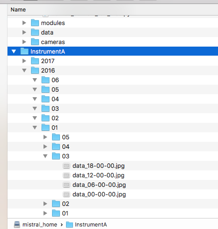

Using typhon.spareice.Dataset For Data Processing
#################################################

**TODO:** Add a small testing dataset for the user.

.. contents:: :local:

.. highlight:: python
   :linenothreshold: 5

What is the idea?
=================

Imagine you have a big dataset consisting of many files containing observations
(e.g. images or satellite data). Each file covers a certain time period and
is located in folders which names contain information about the time period.
See figure :ref:`fig-example-directory` for an example.

.. _fig-example-directory:

   Example of dataset

   All files of *Instrument A* are located in subdirectories which
   contain temporal information in their names (year, month, day, etc.).

Typical tasks to analyze this dataset would include iterating over those
files, reading them, applying functions on their content and eventually
adding files with new data to this dataset. So, how to find all files in a
time period? You could start by writing nested *for* loops and using
python's *glob* function. Normally, such solutions requires time to
implement, are error-prone and are not portable to other datasets with
different structures. Hence, save your time/energy/nerves and simply use
the :class:`~typhon.spareice.datasets.Dataset` class.

Quick Start
===========

We stick to our example from above and want to find all files from our
*Instrument A* dataset between two dates. To do this, we need to initialize a
Dataset object and tell it where to find our files:

.. code-block:: python

   # Import the Dataset class from the typhon module.
   from typhon.spareice.datasets import Dataset

   # Define a dataset object with the files.
   instrument_A = Dataset(
      path="Data/InstrumentA/{year}/{month}/{day}/data_{hour}-{minute}-{second}.nc"
   )

Nothing interesting happens so far. We import the Dataset class from the typhon
module and define the Dataset object, give it a name and tell it where
to find its files. We do it by setting *path* to a generalized path
pattern pointing to each file instead of giving explicit paths. The words
surrounded by braces (e.g. "{year}") are called placeholders. They define
what information can be retrieved from the filename. If you want to know
more about those placeholders, have a look at the section
:ref:`typhon-dataset-placeholders`.

We want to print the names and time coverages of all files from the 1st of
January 2016 (the whole day, i.e. from 0-24h).

.. code-block:: python

    # Find all files between 01/01/2016 and 02/01/2016:
    for file in instrument_A.find_files("2016-01-01", "2016-01-02"):
        print(file)

.. code-block:: none
   :caption: Output:

   File: Data/InstrumentA/2016/01/01/data_00-00-00.nc
       Start: 2016-01-01 00:00:00
       End: 2016-01-01 00:00:00
   File: Data/InstrumentA/2016/01/01/data_06-00-00.nc
       Start: 2016-01-01 06:00:00
       End: 2016-01-01 06:00:00
   File: Data/InstrumentA/2016/01/01/data_12-00-00.nc
       Start: 2016-01-01 12:00:00
       End: 2016-01-01 12:00:00
   File: Data/InstrumentA/2016/01/01/data_18-00-00.nc
       Start: 2016-01-01 18:00:00
       End: 2016-01-01 18:00:00

The :meth:`~typhon.spareice.datasets.Dataset.find_files` method finds all
files between two dates and returns their names and time coverages as
:class:`~typhon.spareice.handlers.FileInfo` objects.

Read and Create Files
=====================

It is nice to iterate over all files from one dataset, but we would like to
read them as well. How to do this? The Dataset object does not know this by
itself but trusts a *file handler* that you may give to it. A file handler is
an object that can read a file in a certain format or write data to it. For
example, if we want to read the files from our *Instrument A* and print out
their content, we need a file handler that can handle netCDF files. Lucky for
us, there is a file handler that can handle such files (it is called
:class:`~typhon.spareice.handlers.commom.NetCDF4`). The only thing that we need
to do now, is giving this file handler object to the Dataset during
initialization:

.. code-block:: python

   # Import the Dataset class from the typhon module.
   from typhon.spareice.datasets import Dataset
   from typhon.spareice.handlers import NetCDF4

   # Define a dataset object with the files.
   instrument_A = Dataset(
      "Data/InstrumentA/{year}/{month}/{day}/data_{hour}-{minute}-{second}.nc",
      # With the next line, the dataset object knows how to handle its files:
      handler=NetCDF4(),
   )

The dataset object knows how to open our files now. We can try it by using the
:meth:`~typhon.spareice.datasets.Dataset.read` method:

.. code-block:: python

   # Open all files between 01/01/2016 and 02/01/2016:
   for file in instrument_A.find_files("2016-01-01", "2016-01-02"):
      print(file)
      data = instrument_A.read(file)
      print(data)

.. code-block:: none
   :caption: Output:

   File: ../../Data/InstrumentA/2016/01/01/data_00-00-00.nc
       Start: 2016-01-01 00:00:00, End: 2016-01-01 00:00:00
   <xarray.Dataset>
   Dimensions:  (dim_0: 100)
   Dimensions without coordinates: dim_0
   Data variables:
       x        (dim_0) int64 0 1 2 3 4 5 6 7 8 9 10 11 12 13 14 15 16  ...
       y        (dim_0) float64 0.0 2.5 5.0 7.5 10.0 12.5 15.0 17.5 ...
   File: ../../Data/InstrumentA/2016/01/01/data_06-00-00.nc
       Start: 2016-01-01 06:00:00, End: 2016-01-01 06:00:00
   ...

There are more file handlers for other file formats. For example,
:class:`~typhon.spareice.handlers.CloudSat` that can read CloudSat files
from HDF4 format. Have a look at :ref:`typhon-handlers` for a complete list of
official handler classes in typhon. If you need a special format that is not
covered by our file handlers, you can customize
:class:`~typhon.spareice.handlers.commom.FileHandler` with some arguments or
you can even write your own file handler (see also :doc:`handlers`).

With file handlers, we can read from a file and write data to it (as long as
the file handler supports this feature). See in this example, how we open each
file from *Instrument A* between *2016-01-01* and *2016-01-02*, read their
content and overwrite them with new content.

.. code-block:: python

   for file in instrument_A.find_files("2016-01-01", "2016-01-02"):
       # Open file:
       data = instrument_A.read(file)

       # Change content:
       data["x"] /= 2

       # Overwrite the old file:
       instrument_A.write(file, data)

Get information about the file
==============================

The Dataset needs temporal information about each file to find them via
:meth:`~typhon.spareice.datasets.Dataset.find_files`. There are three options
to provide this information:

1. Using placeholders in the filename: Set the `info_via` parameter to
   *filename* or *both*.
2. Using the `get_info` method of the file handler: Set the `info_via` parameter
   to *handler* or *both*.
3. Using the parameter *time_coverage* of the Dataset

.. _typhon-dataset-placeholders:

Placeholders
============

Standard placeholders
---------------------

Allowed placeholders in the *path* argument are:

+-------------+------------------------------------------+------------+
| Placeholder | Description                              | Example    |
+=============+==========================================+============+
| year        | Four digits indicating the year.         | 1999       |
+-------------+------------------------------------------+------------+
| year2       | Two digits indicating the year. [1]_     | 58 (=2058) |
+-------------+------------------------------------------+------------+
| month       | Two digits indicating the month.         | 09         |
+-------------+------------------------------------------+------------+
| day         | Two digits indicating the day.           | 08         |
+-------------+------------------------------------------+------------+
| doy         | Three digits indicating the day of       | 002        |
|             | the year.                                |            |
+-------------+------------------------------------------+------------+
| hour        | Two digits indicating the hour.          | 22         |
+-------------+------------------------------------------+------------+
| minute      | Two digits indicating the minute.        | 58         |
+-------------+------------------------------------------+------------+
| second      | Two digits indicating the second.        | 58         |
+-------------+------------------------------------------+------------+
| millisecond | Three digits indicating the millisecond. | 999        |
+-------------+------------------------------------------+------------+

.. [1] Numbers lower than 65 are interpreted as 20XX while numbers
   equal or greater are interpreted as 19XX (e.g. 65 = 1965,
   99 = 1999)

All those place holders are also allowed to have the prefix *end* (e.g.
*end_year*). They will be used to retrieve the end of the time coverage from
the filename.

See this code for a simple example:

.. code-block:: python

   # If we have a Dataset with files:
   dataset = Dataset(
      "{year}/{doy}/{hour}{minute}{second}-{end_hour}{end_minute}{end_second}.nc",
   )
   for file in instrument_A.find_files("2016-01-01", "2016-01-02"):
      print(file)

.. code-block:: none
   :caption: Output:

   2016/001/000000-120000.nc
      Start: 2016-01-01 00:00:00
      End: 2016-01-01 12:00:00

   2016/001/120000-000000.nc
      Start: 2016-01-01 12:00:00
      End: 2016-01-02 00:00:00

User-defined placeholders
-------------------------

Customize the file handler
==========================

Further recipes
===============

Find all files in a period
--------------------------

Read all files in a period
--------------------------

Use multiple processes
----------------------

Use magic indexing
------------------

Find overlapping files between two datasets
-------------------------------------------

Exclude time periods
--------------------

