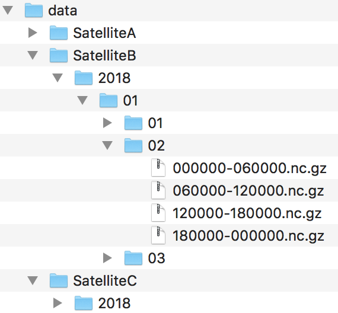
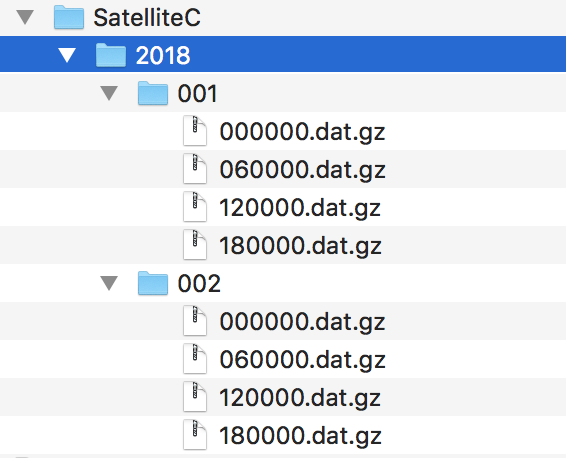

Using FileSet for data processing
#################################

.. contents:: :local:

.. highlight:: python
   :linenothreshold: 5

What is the idea?
=================

Imagine you have a big dataset consisting of many files containing observations
(e.g. images or satellite data). The files cover certain time periods and
are bundled into subdirectories. See
:numref:`Fig.{number}<fig-example-filesets>` for an example.

.. _fig-example-filesets:

   Example of filesets

   All files of *Satellite B* are located in subdirectories which
   contain temporal information in their names (year, month, day, etc.).

Typical tasks to analyze this dataset would include iterating over those
files, finding those that cover a certain time period, reading them, applying
functions on their content and eventually adding files with new data to this
dataset. So, how to find all files in a time period? You could start by writing
nested *for* loops and using python's *glob* function. Normally, such solutions
requires time to implement, are error-prone and are not portable to other
filesets with different structures. Hence, save your time/energy/nerves and
simply use the :class:`~typhon.files.fileset.FileSet` class.

.. Hint::
   If you want to run the code from this tutorial on your machine as well,
   download
   :download:`spareice_tutorials.zip<_downloads/spareice_tutorials.zip>` and
   unzip it. You can find the code examples for this tutorial in the jupyter
   notebook file *dataset.ipynb*. You will need the jupyter_ engine for this.

.. _jupyter: http://jupyter.org/install.html

Find Files
==========

We stick to our example from above and want to find all files from our
*Satellite B* dataset between two dates. To do this, we have to create a
FileSet object with the path to our files:

.. code-block:: python

   # Import the FileSet class from the typhon module.
   from typhon.files import FileSet

   # Define a fileset object pointing to the files
   # of the Satellite B
   b_fileset = FileSet(
       path="data/SatelliteB/{year}-{month}-{day}/"
            "{hour}{minute}{second}-{end_hour}{end_minute}{end_second}.nc"
   )

Nothing interesting happens so far. We imported the FileSet class from the
typhon module, created a FileSet object and told it where to find its files.
These words surrounded by braces (e.g. "{year}") are called placeholders. They
work like regular expressions and generalize the path, so we need not give 
explicit paths that point to each file directly. The FileSet object can fill
those placeholders by itself when searching for files. Let's see it in action:

.. code-block:: python

   # Find all files (but only print the first one)
   for file in b_fileset:
       print(repr(file))

.. code-block:: none
   :caption: Output:

   .../data/SatelliteB/2018-01-01/000000-050000.nc
   .../data/SatelliteB/2018-01-01/050000-100000.nc
   .../data/SatelliteB/2018-01-01/100000-150000.nc
   .../data/SatelliteB/2018-01-01/150000-200000.nc
   .../data/SatelliteB/2018-01-01/200000-010000.nc
   .../data/SatelliteB/2018-01-02/010000-060000.nc
   .../data/SatelliteB/2018-01-02/060000-110000.nc
   .../data/SatelliteB/2018-01-02/110000-160000.nc
   .../data/SatelliteB/2018-01-02/160000-210000.nc
   .../data/SatelliteB/2018-01-02/210000-020000.nc
   .../data/SatelliteB/2018-01-03/060000-120000.nc

If we want to have only files from a certain time period, we can use the
:meth:`~typhon.files.fileset.FileSet.find` method with start and end parameter:

.. code-block:: python

   # Find all files in a certain time period
   for file in b_fileset.find("2018-01-01", "2018-01-01 12:00:00"):
       print(file)

.. code-block:: none
   :caption: Output:

   .../data/SatelliteB/2018/01/01/000000-050000.nc
   .../data/SatelliteB/2018/01/01/050000-100000.nc

In both examples from above, we yield a
:class:`~typhon.spareice.handlers.common.FileInfo` object in the `file`
variable. The FileInfo object has three attributes: *path*, *times* and *attr*.
Let's have a look at them:

.. code-block:: python

   print("Type:", type(file))
   print("Path:", file.path)
   print("Times:", file.times)
   print("Attributes", file.attr)

.. code-block:: none
   :caption: Output:

   Type: <class 'typhon.files.handlers.common.FileInfo'>
   Path: .../data/SatelliteB/2018-01-03/060000-120000.nc
   Times: [datetime.datetime(2018, 1, 3, 6, 0), datetime.datetime(2018, 1, 3, 12, 0)]
   Attributes: {}

Surprisingly, *path* returns the path to the file and *times* is a list with
two datetime objects: the start and end time of the file. They are retrieved by
the placeholders that were used in the `path` argument of the Dataset object.
But what is about *attr* and why is it an empty dictionary? Additionally to the
temporal placeholders (such as {year}, etc.), which are converted into start
and end datetime objects, you can define own placeholders. For example, let's
make a placeholder out of the satellite name:

.. code-block:: python

   # The same dataset as before but with one additional placeholder in the
   # path:
   fileset = FileSet(
     path="data/{satname}/{year}-{month}-{day}/"
          "{hour}{minute}{second}-{end_hour}{end_minute}{end_second}.nc"
   )

   for file in fileset.find("2018-01-01", "2018-01-02"):
     print("Path:", file.path)
     print("Attributes", file.attr)

.. code-block:: none
   :caption: Output:

   Path: .../data/SatelliteA/2018-01-01/000000-040000.nc
   Attributes {'satname': 'SatelliteA'}
   Path: .../data/SatelliteB/2018-01-01/000000-050000.nc
   Attributes {'satname': 'SatelliteB'}
   Path: .../data/SatelliteA/2018-01-01/040000-080000.nc
   Attributes {'satname': 'SatelliteA'}
   Path: .../data/SatelliteB/2018-01-01/050000-100000.nc
   Attributes {'satname': 'SatelliteB'}
   Path: .../data/SatelliteA/2018-01-01/080000-120000.nc
   Attributes {'satname': 'SatelliteA'}
   Path: .../data/SatelliteB/2018-01-01/100000-150000.nc
   Attributes {'satname': 'SatelliteB'}
   Path: .../data/SatelliteA/2018-01-01/120000-160000.nc
   Attributes {'satname': 'SatelliteA'}
   Path: .../data/SatelliteB/2018-01-01/150000-200000.nc
   Attributes {'satname': 'SatelliteB'}
   Path: .../data/SatelliteA/2018-01-01/160000-200000.nc
   Attributes {'satname': 'SatelliteA'}
   Path: .../data/SatelliteA/2018-01-01/200000-000000.nc
   Attributes {'satname': 'SatelliteA'}
   Path: .../data/SatelliteB/2018-01-01/200000-010000.nc
   Attributes {'satname': 'SatelliteB'}

As we can see, we are able to find the data from *Satellite A* as well because
it has the same subdirectory structure as *Satellite B*. The placeholder
*satname* - per default interpreted as wildcard - was filled by Dataset
automatically and returned in *attr*. This could be useful if we want to
process our files and we need to know from which satellite they came from. We
can apply a filter on this placeholder when using
:meth:`~typhon.files.fileset.FileSet.find`:

.. code-block:: python

   filters = {"satname": "SatelliteA"}
   for file in fileset.find("2018-01-01", "2018-01-02", filters=filters):
       print("Path:", file.path)
       print("  Attributes", file.attr)

This finds only the files which placeholder *satname* is *SatelliteA*. We can
also set it to a regular expression. If we want to apply our filter as a black
list, i.e. we want to skip all files which placeholders contain certain values,
we can add a *!* before the placeholder name.

.. code-block:: python

   # This finds all files which satname is not SatelliteA
   filters = {"!satname": "SatelliteA"}

We can also set a placeholder permanently to our favourite regular expression
(e.g. if you want to call :meth:`~typhon.files.fileset.FileSet.find`
multiple times). Use
:meth:`~typhon.files.fileset.FileSet.set_placeholders` for this:

.. code-block:: python

   fileset.set_placeholders(satname="\w+?B")

Which results that we only find satellites which name ends with *B*. If you
want to find out more about placeholders, have a look at this
:ref:`section<typhon-dataset-placeholders>`.

Read and Create Files
=====================

Handling common file formats
++++++++++++++++++++++++++++

Well, it is nice to find all files from one fileset. But we also want to open
them and read their content. For doing this, we could use our found `FileInfo`
objects as file argument for python's `open` builtin function:

.. code-block:: python

   for file in b_fileset.find("2018-01-01", "2018-01-02"):
      with open(file, "rb") as f:
         # This returns a lot of byte strings:
         print(f.readline())

Okay, this may be not very practical for netCDF files since it just returns a
lot of byte strings. Of course, we could use the `python-netcdf`
module for reading the files but our FileSet object provides a much easier way:

.. code-block:: python

   data = b_fileset["2018-01-01"]
   print(data)

.. code-block:: none
   :caption: Output:

   <xarray.Dataset>
   Dimensions:  (time: 15)
   Coordinates:
     * time     (time) datetime64[ns] 2018-01-01 2018-01-01T00:20:00 ...
   Data variables:
       lat      (time) float64 ...
       lon      (time) float64 ...
       data     (time) float64 ...

This found a file that is the closest to 2018-01-01 and decompressed it (if it
was compressed by using zip, gzip or other common compression standards).
Afterwards it loaded its content into an `xarray.Dataset` object (kind of
sophisticated dictionary that holds numpy arrays; have a look at xarray_). And
all this by using only one single expression! We can also read all files from a
time period:

.. _xarray: http://xarray.pydata.org/en/stable/

.. code-block:: python

   # Find files from 2018-01-01 to 2018-01-01 and load them into
   # numpy arrays
   data = b_fileset["2018-01-01":"2018-01-02"]

   # data is now a list of xr.Dataset objects.

What if we want to create a new file for our FileSet? How does this work? It
is as simple as reading them. Create your data object first and then pass it to
the FileSet:

.. code-block:: python

   import xarray as xr

   # Create a xr.Dataset which holds data in form of numpy arrays:
   data = xr.Dataset()
   data['lat'] = 'time', 90 * np.sin(np.linspace(0, 6.28, 7))
   data['lon'] = 'time',  np.linspace(-180, 180, 7)
   data['data'] = data['lat'] * 2 + np.random.randn(7)
   data["time"] = pd.date_range(
       "2018-01-03 06:00:00", "2018-01-03 12:00:00", freq="h"
   )

   # Save this xr.Dataset object to a file that belongs to our fileset. The
   # given timestamps indicate the time coverage of the file:
   b_fileset["2018-01-03 06:00:00":"2018-01-03 12:00:00"] = data

If we look now in our dataset directory, we find a new file called
*data/SatelliteB/2018-01-03/060000-120000.nc*. We can see its content with a
netCDF viewer (e.g. panoply). So our FileSet object took our xarray.Dataset and
put it into a netCDF file automatically. The FileSet object tries to detect
from the path suffix the format of the files. This works for netCDF files
(*\*.nc*) and for CSV files (*\*.txt*, *\*.asc* or *\*.csv*).

Handling other file formats
+++++++++++++++++++++++++++

What happens with files in CSV format but with a different filename suffix? Or
with other file formats, e.g. such as from CloudSat instruments? Can the
FileSet read and write them as well? Yes, it can. But it is going to need some
help of us before doing so. To understand this better, we have to be honest:
the FileSet object cannot do very much; it simply finds files and compress /
decompress them if necessary. However, to read or create files, it trusts a
*file handler* and let it do the format-specific work. A file handler is an
object, which knows everything about a certain file format and hence can read
it or use it to write a new file. The FileSet object automatically tries to
find an adequate file handler according to the filename suffix. Hence, it knew
that our files from *Satellite B* (with the suffix *.nc*) have to be opened
with the
:class:`~typhon.spareice.handlers.common.NetCDF4` file handler.

If we want to use another file handler, we can set the file handler by
ourselves. Let's demonstrate this by using another fileset, e.g. data from
*Satellite C*. Its structure looks like this:

.. _fig-example-dataset_c:

   Files of Satellite C

The files are stored in a different directory structure and are in CSV format.
Instead of having subdirectories with month and day, we now have subdirectories
with the so-called day-of-year (all days since the start of the year). Do not
worry, the FileSet object can handle this structure without any problems with
the temporal placeholder *doy*:

.. code-block:: python

   c_fileset = FileSet(
       path="data/SatelliteC/{year}-{doy}/{hour}{minute}{second}.dat",
   )

   for file in c_dataset.find("2018-01-01", "2018-01-02"):
      print(file)

.. code-block:: none
   :caption: Output

   .../data/SatelliteC/2018-001/000000.dat
      Start: 2018-01-01 00:00:00
      End: 2018-01-01 00:00:00
   ...

But if we try to open one of the files, the following happens:

.. code-block:: python

   data = c_dataset["2018-01-01"]

.. code-block:: none
   :caption: Output

   ---------------------------------------------------------------------------
   NoHandlerError                            Traceback (most recent call last)
   ...

   NoHandlerError: Could not read '.../data/SatelliteC/2018-001/000000.dat'!
      I do not know which file handler to use. Set one by yourself.

It cannot open the file because it could not retrieve a file handler from the
filename suffix. Let's help the Dataset object by setting its file handler to
:class:`~typhon.spareice.handlers.common.CSV` explicitly. Now it should be able
to open these CSV files.

.. code-block:: python

   # Import the CSV file handler
   from typhon.files import CSV

   # Use the CSV file handler for the c_fileset (you could do this also
   # during initialization of the FileSet object):
   c_fileset.handler = CSV()

   # Maybe, the file handler needs some additional information when
   # reading a file? We can set them by *FileSet.read_args*. For example,
   # this let the file handler interpret the column 'time' as timestamp
   # object. Have a look at the CSV file handler documentation
   # to know which else parameters you can pass via read_args:
   c_fileset.read_args={
       "parse_dates": ["time", ]
   }

   # This works now:
   c_fileset["2018-01-01"]

.. code-block:: none
   :caption: Output

   <xarray.Dataset>
   Dimensions:  (index: 15)
   Coordinates:
     * index    (index) int64 0 1 2 3 4 5 6 7 8 9 10 11 12 13 14
   Data variables:
       time     (index) datetime64[ns] 2018-01-01 2018-01-01T00:20:00 ...
       lat      (index) float64 50.59 53.21 55.42 57.21 58.57 59.48 59.94 ...
       lon      (index) float64 -180.0 -177.5 -175.0 -172.5 -170.0 -167.5 ...
       data     (index) float64 99.7 105.6 114.1 114.6 117.0 119.8 120.1 ...

There are more file handlers for other file formats. For example,
:class:`~typhon.files.handlers.cloudsat.CloudSat` can read CloudSat HDF4
files. Have a look at :ref:`typhon-handlers` for a complete list of official
handler classes in typhon. Every file handler might have its own specifications
and options, you can read about them in their documentations.

Handling your file formats
++++++++++++++++++++++++++

If you need a special format that is not covered by the official file handlers,
you can use the generic
:class:`~typhon.files.handlers.common.FileHandler` object and set customized
reader and writer functions. Another way - if you like object-oriented
programming - is to subclass
:class:`~typhon.files.handlers.common.FileHandler` and write your own file
handler class (see :doc:`handlers` for a tutorial). Since the latter is for
more advanced programmers, here is a simple but extensive example that shows
how to use your own reader and writer functions easily. This also shows how to
create a new fileset with many files on-the-fly:

.. code-block:: python

   from datetime import datetime, timedelta

   # Get the base class to use a customized file handler
   from typhon.files import FileHandler

   # Here are our reader and writer functions:
   def our_reader(file_info, lineno=0):
       """Read the nth line of a text file

       Args:
           file_info: A FileInfo object.
           lineno: Number of the line that should be read.
               Default is the 0th line (header).

       Returns:
           A string with the nth line
       """

       with open(file_info, "r") as file:
           return file.readlines()[lineno]

   def our_writer(data, file_info, mode="w"):
      """Append a text to a file

      Args:
          data: A string with content.
          file_info: A FileInfo object.
          mode: The writing mode. 'w' means overwriting
              (default) and 'a' means appending.

      Returns:
          None
      """

      with open(file_info, mode) as file:
          file.write(data)

   # Let's create a file handler with our functions
   our_handler = FileHandler(
       reader=our_reader,
       writer=our_writer,
   )

   # Let's create a new dataset and pass our own file handler
   our_dataset = FileSet(
      path="data/own_dataset/{year}/{doy}/{hour}{minute}{second}.txt",
      handler=our_handler,
   )

   # Fill the dataset with files covering the next two days:
   start = datetime(2018, 1, 1)
   for hour in range(0, 48, 4):
       timestamp = start + timedelta(hours=hour)

       # The content for each file:
       text = f"Header: {timestamp}\n" \
           + "1) First line...\n" \
           + "2) Second line...\n" \
           + "3) Third line...\n"

       # Write the text to a file (uses the
       # underlying our_writer function)
       our_dataset[timestamp] = text

   # Read files at once and get their header line
   # (uses the underlying our_reader function)
   print(our_dataset["2018-01-01":"2018-01-03"])

.. code-block:: none
   :caption: Output

   ['Header: 2018-01-01 00:00:00\n', 'Header: 2018-01-01 04:00:00\n',
    'Header: 2018-01-01 08:00:00\n', 'Header: 2018-01-01 12:00:00\n',
    'Header: 2018-01-01 16:00:00\n', 'Header: 2018-01-01 20:00:00\n',
    'Header: 2018-01-02 00:00:00\n', 'Header: 2018-01-02 04:00:00\n',
    'Header: 2018-01-02 08:00:00\n', 'Header: 2018-01-02 12:00:00\n',
    'Header: 2018-01-02 16:00:00\n', 'Header: 2018-01-02 20:00:00\n']

This script creates files containing one header line with a timestamp and some
further 'data' lines. With our new file handler we can read easily the header
line from each of those files. Great!

Pass arguments to reader and writer
+++++++++++++++++++++++++++++++++++

The `our_reader` function actually provides to return the nth line of the file
if the argument `lineno` is given. If we want to read files with additional
arguments for the underlying reader function, we cannot use the simple
expression with brackets any longer. We have to use the more extended version
in form of the :meth:`~typhon.files.fileset.FileSet.read` method instead:

.. code-block:: python

   # Find the closest file to this timestamp:
   file = our_dataset.find_closest("2018-01-01")

   # Pass the file and the additional argument 'lineno' to the
   # underlying our_reader function:
   data = our_dataset.read(file, lineno=2)

   print(file, "\nData:", data)

.. code-block:: none
   :caption: Output

   .../data/own_dataset/2018/001/000000.txt
     Start: 2018-01-01 00:00:00
     End: 2018-01-01 00:00:00
   Data: 2) Second line...

Using additional arguments for creating a file works very similar as above, we
can use :meth:`~typhon.files.fileset.FileSet.write` here. Another
difference is that we have to generate a filename first by using
:meth:`~typhon.files.fileset.FileSet.get_filename`.

.. code-block:: python

   # Generate a filename for our dataset and a given timestamp:
   filename = our_dataset.get_filename("2018-01-01 04:00:00")

   data = "4) Appended fourth line...\n"

   print(f"Append {data} to {filename}")

   # Pass the data, filename and the additional argument 'mode' to
   # the underlying our_writer function:
   our_dataset.write(data, filename, mode="a")

.. code-block:: none
   :caption: Output

   Append 4) Appended fourth line...
   to .../data/own_dataset/2018/001/000000.txt

How can we read the second lines from all files? We could do this:

.. code-block:: python

   for file in our_dataset:
      data = our_dataset.read(file, lineno=2)
      ...

If you want to use parallel workers to load the files faster (will not
make much difference for our small files here though), use
:meth:`~typhon.files.fileset.FileSet.icollect` in combination with a
for-loop or simply :meth:`~typhon.files.fileset.FileSet.collect` alone:

.. code-block:: python

   # Read the second line of each file:
   for data in our_dataset.icollect(read_args={"lineno": 2}):
      ...

   # OR

   # Read the second line of all files at once:
   data_list = our_dataset.collect(read_args={"lineno": 2})

Get information from a file
===========================

The Dataset object needs information about each file in order to find them
properly via :meth:`~typhon.files.fileset.FileSet.find`. Normally, this
happens by using :ref:`placeholders<typhon-dataset-placeholders>` in the files'
path and name. Each placeholder is represented by a regular expression that is
used to parse the filename. But sometimes this is not enough. For example, if
the filename provides not the end of the file's time coverage but the file does
not represent a single discrete point. Let's have a look at our *Satellite C*
for example:

.. code-block:: python

   from typhon.files import CSV

   # Create a CSV file handler that interprets the column 'time' as
   # timestamp object.
   csv_handler = CSV(
       read_csv={"parse_dates":["time", ]}
   )

   c_dataset = Dataset(
       path="data/SatelliteC/{year}/{doy}/{hour}{minute}{second}.dat.gz",
       handler=csv_handler,
   )

   for file in c_dataset.find("2018-01-01", "2018-01-01 8:00:00"):
       print(file)

.. code-block:: none
   :caption: Output

   .../data/SatelliteC/2018/001/000000.dat.gz
      Start: 2018-01-01 00:00:00
      End: 2018-01-01 00:00:00
   .../data/SatelliteC/2018/001/060000.dat.gz
      Start: 2018-01-01 06:00:00
      End: 2018-01-01 06:00:00

As we can see, are files interpreted as *discrete* files: their start time is
identical with their end time. But we know that is not true, e.g.
*.../data/SatelliteC/2018/001/000000.dat.gz* covers a period from almost six
hours:

.. code-block:: python

   data = c_dataset.read("data/SatelliteC/2018/001/000000.dat.gz")
   print("Start:", data["time"].min())
   print("End:", data["time"].max())

.. code-block:: none
   :caption: Output

   Start: 2018-01-01 00:00:00
   End: 2018-01-01 05:59:59

We have two options now:

1. Use the parameter *time_coverage* of the Dataset to specify the duration per
   file. Works only if each file has the same time coverage. This is the
   easiest and fastest option.
2. Using the file handler to get more information. The file handler can more
   than only reading or creating files in a specific format. If its method
   :meth:`~typhon.spareice.handlers.common.FileHandler.get_info` is set, it can
   complement information that could not be completely retrieved from the
   filename.

Let's try at first option 1:

.. code-block:: python

   c_dataset.time_coverage = "05:59:59 hours"

   for file in c_dataset.find("2018-01-01", "2018-01-01 8:00:00"):
      print(file)

.. code-block:: none
   :caption: Output

   .../data/SatelliteC/2018/001/000000.dat.gz
      Start: 2018-01-01 00:00:00
      End: 2018-01-01 05:59:59
   .../data/SatelliteC/2018/001/060000.dat.gz
      Start: 2018-01-01 06:00:00
      End: 2018-01-01 11:59:59

It works! But what if each file has an individual duration? Then we need to
define a file handler that have a `get_info` method:

TODO: The tutorial will be continued.

.. _typhon-dataset-placeholders:

Placeholders
============

Standard placeholders
+++++++++++++++++++++

Allowed placeholders in the *path* argument are:

+-------------+------------------------------------------+------------+
| Placeholder | Description                              | Example    |
+=============+==========================================+============+
| year        | Four digits indicating the year.         | 1999       |
+-------------+------------------------------------------+------------+
| year2       | Two digits indicating the year. [1]_     | 58 (=2058) |
+-------------+------------------------------------------+------------+
| month       | Two digits indicating the month.         | 09         |
+-------------+------------------------------------------+------------+
| day         | Two digits indicating the day.           | 08         |
+-------------+------------------------------------------+------------+
| doy         | Three digits indicating the day of       | 002        |
|             | the year.                                |            |
+-------------+------------------------------------------+------------+
| hour        | Two digits indicating the hour.          | 22         |
+-------------+------------------------------------------+------------+
| minute      | Two digits indicating the minute.        | 58         |
+-------------+------------------------------------------+------------+
| second      | Two digits indicating the second.        | 58         |
+-------------+------------------------------------------+------------+
| millisecond | Three digits indicating the millisecond. | 999        |
+-------------+------------------------------------------+------------+

.. [1] Numbers lower than 65 are interpreted as 20XX while numbers
   equal or greater are interpreted as 19XX (e.g. 65 = 1965,
   99 = 1999)

All those place holders are also allowed to have the prefix *end* (e.g.
*end_year*). They will be used to retrieve the end of the time coverage from
the filename.

User-defined placeholders
+++++++++++++++++++++++++

Further recipes
===============

Use multiple processes
++++++++++++++++++++++

Copy or convert files
+++++++++++++++++++++

Use filters with magic indexing
+++++++++++++++++++++++++++++++

Exclude or limit to time periods
++++++++++++++++++++++++++++++++

